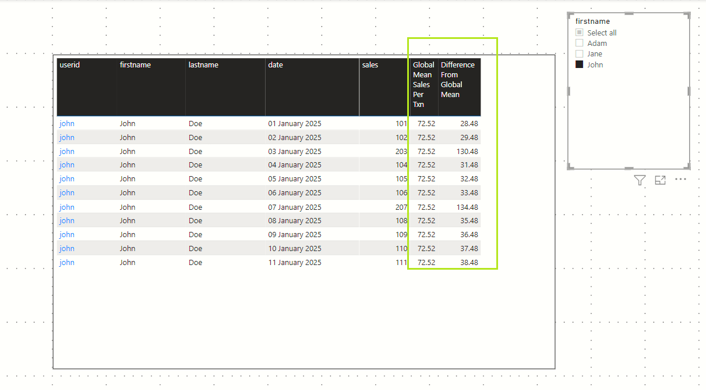

# A simple constant valued DAX measure gave me so much headache

# Introduction


[DAX](https://docs.microsoft.com/en-us/dax/#:~:text=Data%20Analysis%20Expressions%20(DAX)%20is,Pivot%20in%20Excel%20data%20models.)  is a high level language designed exclusively by Microsoft to interface with `Sql Server Analysis Services Tabular engine` and `Power BI`.
For most parts, DAX is not complex. But, there are these nuances which crop up time to time which rattles my confidence in DAX. In this article, 
I present one such nuance involving measures and Table Visuals that gave me a lot of grief. The good news is that the solution turned out to be a 1 liner!


#### What harm can this measure do?

Look at this 1 liner DAX measure. This looks so harmless. 
```
MyConstantValue = 123
```
What do we expect if I add this measure to a Table visual? Depending on the table columns already present in the Table visual, a lot can go wrong!
In my scenario, the presence of the measure `MyConstantValue` would cause new rows appear in the Table visual (see pic above).

#### Inspiration for this article
The scenario which introduced me to this challenge was to calculate the difference in the `sales of a transaction` from the `global mean sale per transaction`.



---

# Sample dataset
I have created this abstracted dataset to better explain this problem.

#### List of tables
- Users
- Sales

#### Relationship
A simple 1-many relationship between `Users` and `Sales` tables


#### Data in this dataset
#### Users


#### Sales


---

# Reproducing the problem
We want a report that displays all the Sales transactions for the selected user.
This report would have the following:
- A Table visual displaying records from Sales table
- A Slicer visual to let us select the User
- We want to display some additional metric in the Table visual (e.g. Difference of the Sale amount from the overall average Sale per transaction). We will create a measure for this.


#### Step 1 - A Table visual with Sales and User Columns
We want to display data from the `Sales` table and enrich with data from the `Users` table.
1. Sales[userid]
1. Users[firstname] and Users[lastname]
1. Sales[sales]

#### Step 2 - A Slicer visual on Users

We want to have the ability to see the Sales data of a specified User. Therefore, we need a Slicer which is wired to the `Users[firstname]` or `Users[lastname]` column.

#### Step 3 - Add the constant valued measure to the Table and  behold!!
Create the following constant valued measure.
```
MyConstantValue = 123
```
Add this measure to the Table visual.


We can immediately see that there is a problem. The `Sales[userid]` column in the Table visual has pulled in rows for both `Jane` and `John`, while the Slicer selection is on `John` only!

---

# What is the reason for this bizarre behaviour?
With some help from Power BI community, I have arrived at an explanation.  
#### Without the constant valued measure
When we have the columsn `Sales[userid]`,`Users[firstname]` and `Users[lastname]`, the Table visual has no problem in understanding the data relationship.

- The Table visual sees the Tables `Sales` and `Users` and detects the presence of a 1-many relationship
- For every row in Sales table, the Table visual resolves the `firstname` and `lastname` columns from the `Users` table

#### With the constant valued measure
When we add the measure `MyConstantValue` to the Table visual, the visual appears to get 'confused' about the relationships. 
For lack of better words - the DAX row context is altered in a way that the Table visual is unable to make sense of any relationship between the measure column and the `Sales` table. 
It ends up displaying all records from the `Sales` table.

---

# How to solve this problem?
We will make slight changes to our custom Measure. Let us create a new measure.
```
MyConstantValue2 = 
var userid=SELECTEDVALUE(Sales[userid])
RETURN IF (ISBLANK(userid),BLANK(),123)
```
We are now forcing the measure to emit a value only if there is a valid `userid` from the `Sales` table


The Table visual correctly displays records for the user selected in the Slicer visual.

---

# A more meaningful scenario

If you recall, my original objective was to calculate the how far away every sales transaction is from the global mean amount per transaction.


#### GlobalMeanSalesPerTxn
Calculates the mean sales amount per transaction across all the sales
```
GlobalMeanSalesPerTxn = 
var countOfSalesPersons = CALCULATE(COUNT(Users[userid]), ALL(Users))
VAR totalSales = CALCULATE(AVERAGE(Sales[sales]),ALL(Sales))
var overallMean = totalSales
return overallMean
```

#### GlobalMeanSalesPerTxnWithFix
Applies the "fix" we discussed above.
```
GlobalMeanSalesPerTxnWithFix = 
VAR salesperuser= AllMeasures[GlobalMeanSalesPerTxn]
VAR userid = SELECTEDVALUE(Sales[userid])

return IF(ISBLANK(userid), BLANK(), salesperuser)   #The fix!
```

#### DifferenceFromGlobalMeanPerTxn
Calculates the difference between the current row sales and the global mean sales.
```
DifferenceFromGlobalMeanPerTxn = 
VAR avgSalesPerTxn = AllMeasures[GlobalMeanSalesPerTxnWithFix]
VAR salesInThisRow=SELECTEDVALUE(Sales[sales])
VAR diff = salesInThisRow - avgSalesPerTxn
return diff
```

# Accompanying Power BI and Excel file

#### Github
https://github.com/sdg002/sdg002.github.io/tree/master/dax-constant-valued-measure

#### DummySales.pbix
The Power BI with worked out measures and visuals

#### DummyData.xlsx
The Excel which drives the Power BI


# References
[Power BI community response to this problem](https://community.powerbi.com/t5/Desktop/Adding-a-simple-constant-valued-measure-stops-breaks/m-p/2242681#M816817)

