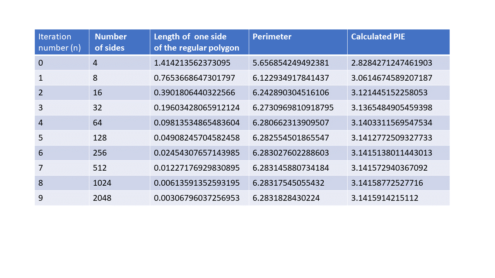
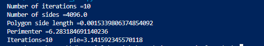

# Calculate Pie using Pythogoras theorem
In this article I have presented what is possibly one of the oldest and simplest methods to calculate the value of Pie. The principle relies on inscribing a square within a cirlce of radius 1 unit and then doubling the sides in every iteration. The perimeter of the polygon inscribed within the circle tends towards **2 x PIE x radius**

---


# 4 sides


---

# 8 sides


---

# 16 sides


---

# Perimeter with 4 sides
Let us try and derive a formula for the perimeter of an inscribed polygon. We will use recursion.


---

# From 4 sides to 8 sides


# From 4 sides to 8 and 8 sides to 16 - how to determine the perimeter?


---

# Where are we?

We begin with a **square** with side **s0** -->   sub-divide to get an **octagon** with side **s1** --> sub-divide to get a **16 sided regular polygon** with side **s3**

We now have a recursive formula which given the regular polygon length **s(n)** yields **s(n+1)** 


---

# Final results



# About the code


## Link to Gitub repo

The Github repo can be [found here](https://github.com/sdg002/sdg002.github.io/tree/master/pie-geometrical-method)

## Running the Python file
The file `calculate_pie.py` takes 1 argument. This is the number of iterations.

Example:
```python
calculate_pie.py 10
```



