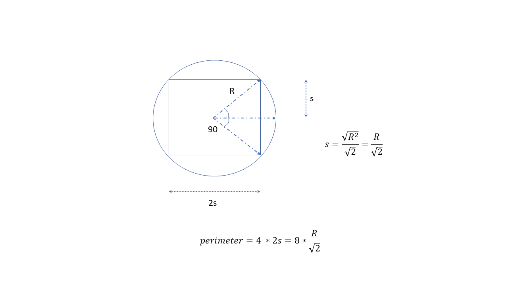
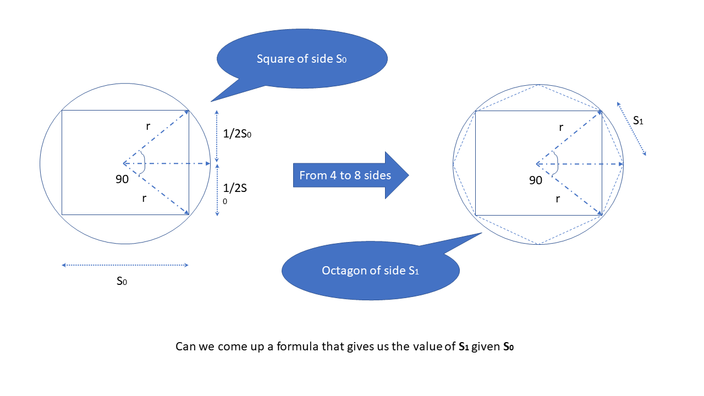
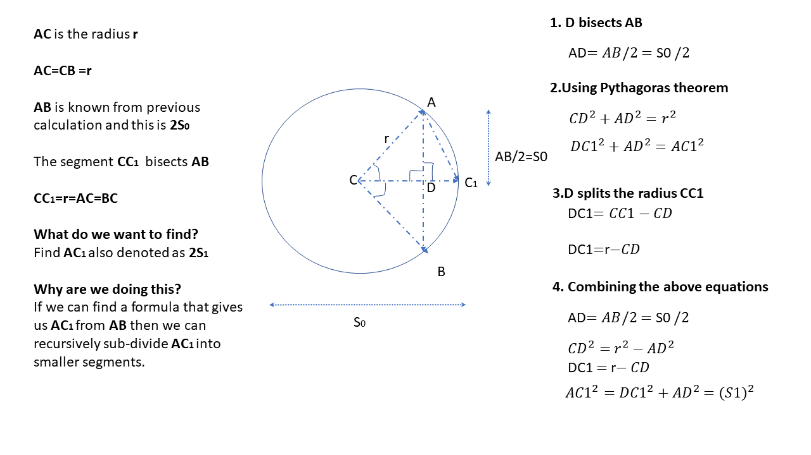
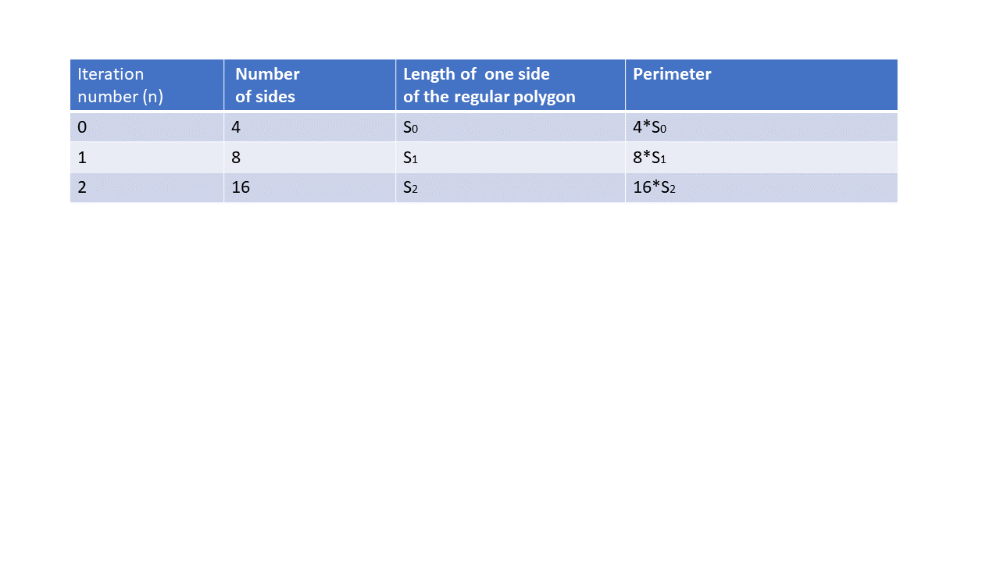

# About
A simple geometrical approach to calculate the value of PIE

# To be done

# 4 sides

---

# 8 sides

---

# 16 sides

---

# Perimeter with 4 sides

# From 4 sides to 8 sides

# From 4 sides to 8 and 8 sides to 16 - how to determine the perimeter?

# Where are we ?

We begin with a **square** with side **2*s0** -->   sub-divide to get an **octagon** with side **2*s1** --> sub-divide to get an **16 sided regular polygon** with side **2*s3**

We now have a recursive formula which given the regular polygon length **s(n)** yieds **s(n+1)** 

