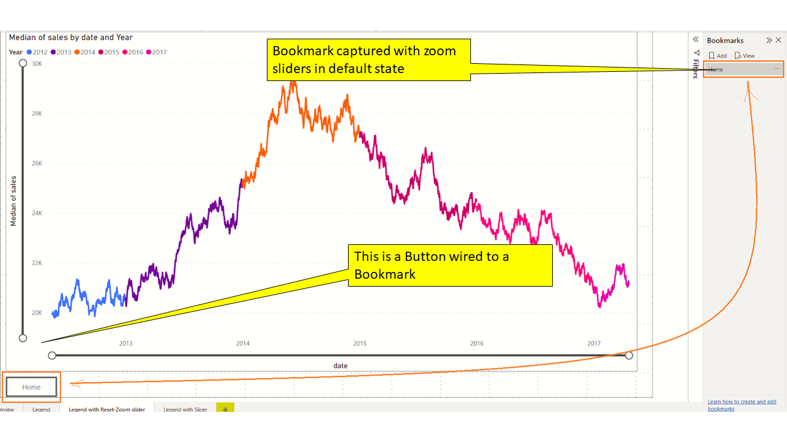
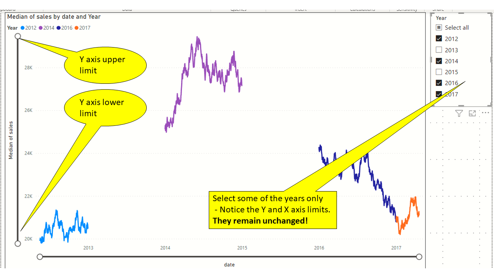
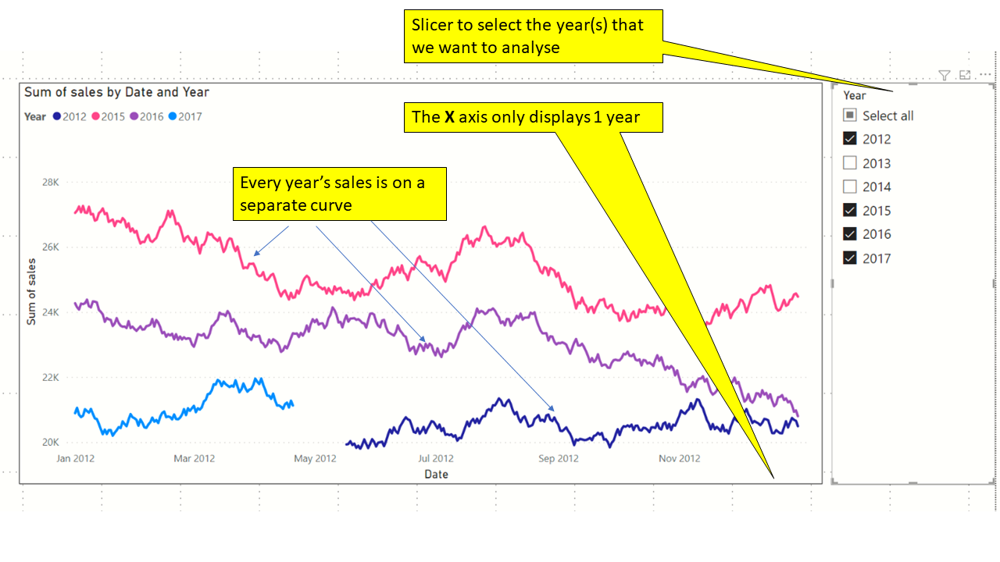

# Power BI line chart with multiple years of Sales/Time series Data - So many options!

---

# Problem statement

I have 5 years of daily sales data (or any time series data) lying around in a simple CSV file. This CSV could be a one time dump of data produced from the ERP system of my company. How do I make the best use of Power BI to spot trends and make projections?
Why am I writing about this? Doesn't Power BI already handle this out of box? The problem is deceptively simple. Yes - Power BI can handle this out of box but there are myriad options and switches that once could toggle. 
I decided to write a step-by-step article so that I could present my journey - starting from the most basic Line Chart of Power BI and incrementally tweaking  all available options along the way.

---

# About the data


This data has been synthetically generated over a 5 year period using a Python script. This has just 2 columns: **Date** and **Sales**.

---

# Which version of Power BI Desktop?
All visuals in this article were carried out using Power BI Desktop version 2.104.941


We can see that we have 
- 1800 days of data
- Starting from 17 May 2012 
- Ending on 20 April 2017
- Min sales is 19,791
- Max sales is 23,859

I have turned off the out of box date hierarchy creation form the  "**Date and time intelligence**" settings. In later stages we will create this hierarchy through custom calculated columns.


Refer accompanying PBIX **data_overview.pbix**

---

# Version 1.0 - All years in a single line - Most basic 
- We have not added any legend
- We have added a zoom slider
- X axis displays the **Date** column in a Continuous fashion
- Y axis displays the **Median Sales** column


(Refer sheet **V1.0-Most basic** in the accompanying file **v1-single_line_for_all_years-most-basic.pbix**)

---

# Version 1.1 - All years in a single line - Most basic  (Categorical X axis)
- We have not added any legend
- We have added a zoom slider
- X axis displays the **Date** column in a Categorical fashion
- Y axis displays the **Median Sales** column


Changing the X-axis to **Categorical** from **Continuous** has radically altered the behaviour of the axis.

#### Advantage of Categorical
You get to analyze the data at a very micro level

#### Disadvantage of Categorical
You lose the ability to zoom into the data gradually. You want to a higher level view of the data first. You need to scroll a much larger distance horizontally.

(Refer sheet **V1.1-Most basic - Categorical** in accompanying file **V1-single_line_for_all_years-most-basic.pbix**)

---

# Version 2.1 - All years in a single visual (single curve) - Add a Legend on Year
Our "**out of box**" approach so far is good, but suffers from a few challenges. Namely:
- Difficult to distinguish the Years visually
- Lack of a legend

#### Adding time intelligence
We decided against using the out of box date hierarchy. Lets add some calculated columns to the "Sales" table

```dax
Year = YEAR([date])

MonthNumber = MONTH([Date])

MonthText = FORMAT([Date],"mmmm")

DayNoOfYear = DATEDIFF ( DATE ( YEAR ( sales[date] ), 1, 1 ), sales[date], DAY ) + 1
```


#### Ensuring MonthText is correctly sorted


##### Finally adding the legend


(Refer sheet **v2.1-Legend** in the accompanying file **single_line_for_all_years-legend.pbix**)

---
# Version 2.2 - How to reset the Zoom sliders back to their default state (a Home button)?
Zoom sliders are great. They let you quickly narrow down on a region of interest. They are turned off by default. 


_How do you go back to the default position in a single click?_ For those who have used the popular Python plotting library **Matplotlib**, you would be familiar with the **Home** button.





In the above example, I used a **Button** visual linked to a **Bookmark** which provide a _Home_ button like functionality.


(Refer sheet **v2.2-Legend with Reset-Zoom slider** in the accompanying file **v2-single_line_for_all_years-legend.pbix**)


---

# Version 2.3 - Using a Slicer to select one or more year(s) of data
The user of the report may not want to handle all 5 years at once. A legend is good to point and select the year of interest. However, we need to use a Slicer if we want to be selective about the data


(Refer sheet **v2.3-Legend with Slicer** in the accompanying file **v2-single_line_for_all_years-legend.pbix**)

---

# Version 2.4 - Keeping the X and Y axis steady while we use the slicer

#### Understanding the problem ?
Consider the Slicer selection in the picture below. We have have selected the years 2012 and 2013. Pay attention to the lower and upper limits of the X axis. (lower=July 2012, upper=Oct 2013)


In the following configuration, we have selected 2012 only. Pay attention to the lower and upper limits of the X axis once again (lower=June 2012, upper=Dec 2012)


By design, Power BI line charts are designed to display only the selected band on the X axis and Y axis. Therefore, the scale of the X axis considerably changes when we alter the Year selection in the Slicer.

#### Is this a problem that needs to be solved?
Depends. Quite often I like to have a steady reference while slicing an dicing the data using Slicers. If the scale of the visuals alter too much then I find myself unable to build a mental model of the trends in the data. 

#### How do we address this?

Power BI lets us specify a measure to set the lower and upper bounds of X and Y axis.

#### Fixing the X axis
```dax
EarliestSalesDate = CALCULATE(MIN(sales[date]),ALL(sales))
MotRecentSalesDate = CALCULATE(MAX(sales[date]),ALL(sales))
```

Create the measures as shown above and assign them to the "Minimum" and "Maximum" of the X axis.


#### Fixing the Y axis

```dax
LowestSalesValue = CALCULATE(MIN(sales[sales]),ALL(sales))
HighesSalesValue = CALCULATE(MAX(sales[sales]),ALL(sales))
```

Create the measures as shown above and assign them to the "Minimum" and "Maximum" of the Y axis.


#### The nex X and Y axis with measures applied


Now change the selection of the Years in the slicer



(Refer sheet **v2.4-Keeping X-Y axis steady** in the accompanying file **v2-single_line_for_all_years-legend.pbix**)

---
# Version 3.1 - Simple monthly view - All Years visible
We will use our calculated columns **MonthText** and **Year** to produce a very simple but functional clustered column chart that displays a Month wise aggregation of Sales across several years


(Refer sheet **v3.1-Simple monthly break down-All Years** in the accompanying file **v3-monthly-view.pbix**)

---
# Version 3.2 - Simple monthly view - Slicer on years
Like before, we introduce a Slicer visual to selectively the hide the Years we are not interested in. The **Slicer** has the **Orientation** property set to **Horizontal** for better utisation of real estate


(Refer sheet **v3.2-Simple monthly break down-Slicer on Years** in the accompanying file **v3-monthly-view.pbix**)

---

# Verion 4.0 - Multiple years of sales stacked on the same plot

## What do we want to achieve?
We want to analyze multiple years of data - but not as one large curve. We want the X-axis to span for just 1 year (Jan 1 to Dec 31) and stack each years Sales within the same chart.




## How do we achieve this?
1. Create a new calendar table with only days from the year 2012 . Name this table **My2012DatesTable**
1. Why 2012?  Not neccessary. You can select any leap year. Example: 2016
1. Add a relationship between **My2012DatesTable** and **Sales** table using the key column **DayNoOfYear**
1. Add a **Line Chart** visual. 
1. Use the **My2012DatesTable**->**Date** field for the X axis (This will produce dates from Jan 1 to Dec 31 2012)
1. Use the **Sales**->**sales** field for the Y axis
1. Use the **Sales**->**Year** as the Legend. 
1. Follow the steps we did in earlier to keep the Y axis boundaries steady (Refer section "Keeping the X and Y axis steady while we use the slicer")

## DAX expression for My2012DatesTable
Use the following DAX to create the new Date table which has just 1 year of dates
```dax
My2012DatesTable = 
VAR myExtendedCalendar = ADDCOLUMNS(
            CALENDAR(DATE(2012,1,1),DATE(2012,12,31)), 
            "Year", YEAR([Date]),
            "MonthNumber", MONTH([Date]),
            "DayNumber", DAY([Date]),
            "Month", FORMAT([Date],"mmmm"),
            "DayOfWeek", FORMAT([Date],"ddd"),
            "DayOfWeekNumber", WEEKDAY([Date]),
            "QuarterNumber", QUARTER([Date]),
            "Quarter", FORMAT([Date],"\QQ"),
            "WeekNumber",WEEKNUM([Date]), 
            "MonthDayKey",FORMAT([Date],"mmm-dd")
            )
VAR myExtendedCalendarWithDayOfYear = ADDCOLUMNS(
            myExtendedCalendar, 
            "DayNoOfYear",
            DATEDIFF ( DATE ( YEAR ( [Date] ), 1, 1 ), [Date], DAY ) + 1
            )

return myExtendedCalendarWithDayOfYear
```

## Add relationships


## Create the Line Chart visual


## Ensuring that Y axis is steady


---

# TRIALS BELOW - SHOULD BE REMOVED WHEN DONE


# Iteration 2.4 - All years in a single visual (single curve) - Fill missing trailing and leading dates
- Explain the problem of the missing dates
- Problem - The first year and the last year do not have all the days of data. Hence the limts of the X axis keep changing as we select/de-select years 


---

# Iteration 3 - Multiple curves in a single visual (1 curve for every year)
- The need to turn off/on selective years
- A legend with years
<< Talk about the need for additional column DayNoOfYear >>
<< Multiple lines >>


---

# Iteration 3.2 - Changing from continuous to categorical
<< to be done, continuation of I3>>


# Iteration 4 -  Using tooltips to zoomin
- to be done
- See my notes in the notebook
- How do you come out of the Calendar context? Use another Date table perhaps?

# Iteration X - Small multiples (WE MAY NOT NEED THIS, IF WE ARE NOT DOING MULTIPLE VISUALS)
<< to be done >>


# Accompanying files in Github
Provide link to Github
Explain the repo structure
<< to be done >>

# Misc
- Grid lines
- Series labels
- Markers
- 
# Customize the title by using a measure
to be done

# To be done
- ~~Improve the synthetic data generation (slowly risising, with some randomness)~~
- Can we rest the view when using Zoom sliders?
- 