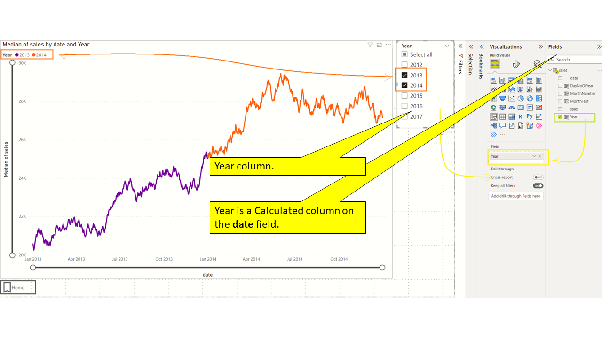

# Power BI line chart with multiple years of Sales/Time series Data - So many options!

---

# Problem statement

I have 5 years of daily sales data (or any time series data). How do I make the best use of Power BI to spot trends and make projections?
Why am I writing about this? Doesn't Power BI already handle this out of box? The problem is deceptively simple. Yes - Power BI can handle this out of box but there are myriad options and switches that once could toggle. 
I decided to write a step-by-step article so that I could present my journey - starting from the most basic Line Chart of Power BI and then adding more features along the way.

---

# About the data


This data has been synthetically generated over a 5 year period using a Python script. This has just 2 columns: Date and Sales.

---

# Which version of Power BI Desktop?
All visuals in this article were carried out using Power BI Desktop version 2.104.941


We can see that we have 
- 1800 days of data
- Starting from 17 May 2012 
- Ending on 20 April 2017
- Min sales is 19,791
- Max sales is 23,859

I have turned off the out of box date hierarchy creation form the  "Date and time intelligence" settings. In late stages we will create this hierarchy through custom calculated columns.


Refer accompanying PBIX "data_overview.pbix"

---

# All years in a single line - Most basic 
- We have not added any legend
- We have added a zoom slider
- X axis displays the "Date" column in a Continuous fashion
- Y axis displays the "Median Sales" column


---

# All years in a single line - Most basic  (Categorical X axis)
- We have not added any legend
- We have added a zoom slider
- X axis displays the "Date" column in a Categorical fashion
- Y axis displays the "Median Sales" column


Changing to "Categorical" from "Continuous" has radically altered the behaviour of the X-axis.
#### Advantage of Categorical
You get to analyze the data at a very micro level

#### Disadvantage of Categorical
You lose the ability to zoom into the data gradually. You want to a higher level view of the data first.

---

# All years in a single visual (single curve) - Add a Legend on Year
Our "out of box" approach so far is good, but suffers from a few challenges. Namely:
- Difficult to distinguish the Years visually
- Lack of a legend

#### Adding time intelligence
We decided against using the out of box date hierarchy. Lets add some calculated columns to the "Sales" table

```dax
Year = YEAR([date])

MonthNumber = MONTH([Date])

MonthText = FORMAT([Date],"mmmm")

DayNoOfYear = DATEDIFF ( DATE ( YEAR ( sales[date] ), 1, 1 ), sales[date], DAY ) + 1
```


#### Ensuring MonthText is correctly sorted


##### Finally adding the legend


---
# How to reset the Zoom sliders back to their default state (a Home button)?
Zoom sliders are great. They let you quickly narrow down on a region of interest. They are turned off by default. 


**to be done  Pin point the zoom slider, stress on dragging back the slider**

How do you go back to the default position in a single click? For those who have used Matplotlib, you would be familiar with the "Home" button.


**to be done Pint point that this is a button whose action is wired to a tooltip**

In the above example, I used a Button linked to a Bookmark which provide a "resetting" like functionality.

---
# Using a Slicer to select one or more year(s) of data
The user of the report may not want to handle all 5 years at once. A legend is good to point and select the year of interest. However, we need to use a Slicer if we want to be selective about the data


---

# Keeping the X and Y axis steady while we use the slicer

#### Understanding the problem ?
Consider the Slicer selection in the picture below. We have have selected the years 2012 and 2013. Pay attention to the lower and upper limits of the X axis. (lower=July 2012, upper=Oct 2013)


In the following configuration, we have selected 2012 only. Pay attention to the lower and upper limits of the X axis once again (lower=June 2012, upper=Dec 2012)


By design, Power BI line charts are designed to display only the selected band on the X axis and Y axis. Therefore, the scale of the X axis considerably changes when we alter the Year selection in the Slicer.

#### Is this a problem that needs to be solved?
Depends. Quite often I like to have a steady reference while slicing an dicing the data using Slicers. If the scale of the visuals alter too much then I find myself unable to build a mental model of the trends in the data. 

#### How do we address this?

Power BI lets us specify a measure to set the lower and upper bounds of X and Y axis.

#### Fixing the X axis
```dax
EarliestSalesDate = CALCULATE(MIN(sales[date]),ALL(sales))
MotRecentSalesDate = CALCULATE(MAX(sales[date]),ALL(sales))
```

Create the measures as shown above and assign them to the "Minimum" and "Maximum" of the X axis.


#### Fixing the Y axis

```dax
LowestSalesValue = CALCULATE(MIN(sales[sales]),ALL(sales))
HighesSalesValue = CALCULATE(MAX(sales[sales]),ALL(sales))
```

Create the measures as shown above and assign them to the "Minimum" and "Maximum" of the Y axis.


#### The nex X and Y axis with measures applied


We can see that the X axis is stretching right up to 2015. This is inspite of the year "2017" not being selected in the slicer.


---

# Iteration 2.4 - All years in a single visual (single curve) - Fill missing trailing and leading dates
- Explain the problem of the missing dates
- Problem - The first year and the last year do not have all the days of data. Hence the limts of the X axis keep changing as we select/de-select years 

---

# Iteration 2.5 - Steady Y axis
- Explain the problem. The Y axis keeps jumping
Set the Y axis lower and upper limits to a Measure which returns hard coded values
- Use 2 measures to set the lower and upper limits of the X axis

---

# Iteration 3 - All years in a single visual (1 curve for every year)
- The need to turn off/on selective years
- A legend with years
<< Talk about the need for additional column DayNoOfYear >>
<< Multiple lines >>

---

# Iteration 3.1 - Zoom sliders (investigate)
- How to restore to non-zoom
- 

---

# Iteration 3.2 - Changing from continuous to categorical
<< to be done, continuation of I3>>


# Iteration 4 -  Using tooltips to zoomin
- to be done
- See my notes in the notebook
- How do you come out of the Calendar context? Use another Date table perhaps?

# Iteration X - Small multiples (WE MAY NOT NEED THIS, IF WE ARE NOT DOING MULTIPLE VISUALS)
<< to be done >>


# Accompanying files in Github
Provide link to Github
Explain the repo structure
<< to be done >>

# To be done
- ~~Improve the synthetic data generation (slowly risising, with some randomness)~~
- Can we rest the view when using Zoom sliders?
- 