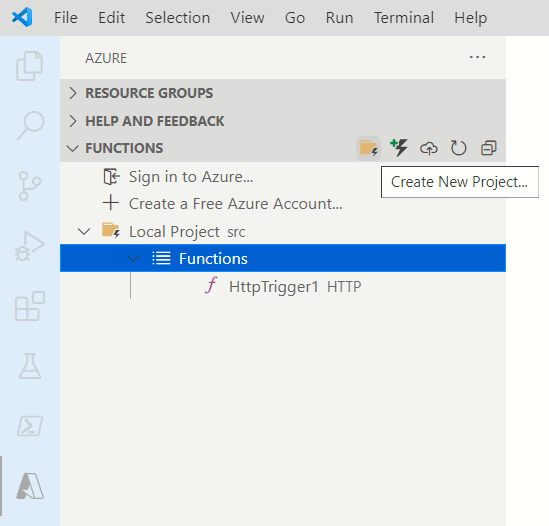

# Overview
- Demonstrates a Python Azure Function
- Demonstrates a Infrastructure script to deploy the Azure function to the cloud
- We are not doing the CI configuration using Jenkins or Azure Devops, however we intend to have a single PowerShell script ready for CI

---

# Tasks
- ~~Look into the desired folder strucutre~~
- ~~Create a skeletal working Azure function~~
- ~~Add trigger to add 2 numbers~~
- ~~Test the trigger locally~~
- ~~Structure the folder to keep the Math lib outside~~
- ~~Deploy to Azure~~
- Write some unit tests
~~- How to set configuration settings on Azure?~~
- Write a PowerShell script to run the unit tests and run PEP8 (under build folder)
- 

# You were addressing the problem about the deployment in progress
```
Performing remote build for functions project.
Deleting the old .python_packages directory
Uploading 7.91 KB [###############################################################################]
Error Uploading archive... (Conflict).
Server Response: There is a deployment currently in progress. Please try again when it completes.
```

---
 
# Recommended folder structure by Microsoft
As per [guidance from Microsoft](https://docs.microsoft.com/en-us/azure/azure-functions/functions-reference-python?tabs=asgi%2Cazurecli-linux%2Capplication-level#folder-structure),
```
 <project_root>/
 | - .venv/
 | - .vscode/
 | - my_first_function/
 | | - __init__.py
 | | - function.json
 | | - example.py
 | - my_second_function/
 | | - __init__.py
 | | - function.json
 | - shared_code/
 | | - __init__.py
 | | - my_first_helper_function.py
 | | - my_second_helper_function.py
 | - tests/
 | | - test_my_second_function.py
 | - .funcignore
 | - host.json
 | - local.settings.json
 | - requirements.txt
 | - Dockerfile
```
# Steps for creating a skeletal Azure Function
- Ensure you have the **[Azure Functions Core Tools](https://docs.microsoft.com/en-us/azure/azure-functions/functions-run-local)** tool installed
- Ensure you have the **Azure Functions Extensions** for Visual Studio Code installed
- Click on the **New Project** icon and respond to the questions from the wizard
- 


---

# References
- [Quickstart: Create a Python function in Azure from the command line](https://docs.microsoft.com/en-us/azure/azure-functions/create-first-function-cli-python?tabs=azure-cli%2Cbash%2Cbrowser)
- [Quickstart: Create a function in Azure with Python using Visual Studio Code](https://docs.microsoft.com/en-us/azure/azure-functions/create-first-function-vs-code-python)
- [Configure a Linux Python app for Azure App Service](https://docs.microsoft.com/en-us/azure/app-service/configure-language-python)
- ??
- [Azure Functions Python developer guide](https://docs.microsoft.com/en-us/azure/azure-functions/functions-reference-python)
- ??
- 
- 


# How to deploy?
In case of Python, there is no build command (unlike C# or NodeJS). Therefore you will need to publish the raw contents. But,we must remember that the project directory has lots of files which are not to be deployed. E.g. the `.venv` directory.

## The publish command
You will need to use the Azure Function Core tool as follows:
```
func azure functionapp publish [name of the function app]
```
The function app should have been created prior to the above step using methods like `az functionapp plan create` and `az functionapp create`

## Setting the Azure Context correctly
Before you run the publish command, the Azure subscription must have been set correctly. This is neccessary for Azure Function Core tool to detect the function app.  Run the following commands to ensure you are console is pointing to the right subscription. 
```
az account show
```

```
Get-AzContext
```

## Further reference
Follow [this link](https://docs.microsoft.com/en-us/azure/azure-functions/functions-core-tools-reference?tabs=v2#func-azure-functionapp-publish) for more details on how to use the **Func** tool

---

You were reading this https://docs.microsoft.com/en-us/azure/azure-functions/functions-core-tools-reference?tabs=v2#func-azure-functionapp-fetch-app-settings

You were trying the following, it did not work, needs functionapp names
```
func azure functionapp publish  --list-ignored-files
```

---


# Appendix
## How to set Configuration parameters on Azure?
Example snippet below:
```
    $settings=@{"name1"="value1"; "name2"="blah2"; "name3"="blah3"}
    Update-AzFunctionAppSetting -ResourceGroupName  $ResourceGroup -Name $FunctionApp -AppSetting $settings
```

Refer [documentation](https://docs.microsoft.com/en-us/azure/azure-functions/functions-how-to-use-azure-function-app-settings?tabs=azure-powershell#settings) from Microsoft

## How to specify the Python version of the Azure function app?
The commandline option `functions-version` of `az functionapp create` specifies the Python engine version
```
az functionapp create --name $FunctionApp --resource-group $ResourceGroup --plan $FunctionAppPlan --storage-account $FunctionStorageAccount --runtime python --runtime-version 3.8 --functions-version 3 --disable-app-insights
```

# How to find the supported Python versions on Azure?
Why is this important? Your local development environment is restricted by the runtimes supported on Azure.
```
az webapp list-runtimes 
```
Sample output as of April 2022:
```
{
  "linux": [
    "DOTNETCORE:6.0",    
    "DOTNETCORE:5.0",    
    "DOTNETCORE:3.1",    
    "NODE:16-lts",       
    "NODE:14-lts",       
    "NODE:12-lts",       
    "PYTHON:3.9",        
    "PYTHON:3.8",        
    "PYTHON:3.7",        
    "PHP:8.0",
    "PHP:7.4",
    "RUBY:2.7",
    "RUBY:2.7.3",        
    "JAVA:11-java11",    
    "JAVA:8-jre8",       
    "JBOSSEAP:7-java11", 
    "JBOSSEAP:7-java8",  
    "TOMCAT:10.0-java11",
    "TOMCAT:10.0-jre8",  
    "TOMCAT:9.0-java11", 
    "TOMCAT:9.0-jre8",   
    "TOMCAT:8.5-java11",
    "TOMCAT:8.5-jre8"
  ],
  "windows": [
    "dotnet:6",
    "dotnet:5",
    "DOTNETCORE:3.1",
    "ASPNET:V4.8",
    "ASPNET:V3.5",
    "NODE:16LTS",
    "NODE:14LTS",
    "NODE:12LTS",
    "PHP:7.4",
    "java:1.8:Java SE:8",
    "java:11:Java SE:11",
    "java:1.8:TOMCAT:10.0",
    "java:11:TOMCAT:10.0",
    "java:1.8:TOMCAT:9.0",
    "java:11:TOMCAT:9.0",
    "java:1.8:TOMCAT:8.5",
    "java:11:TOMCAT:8.5"
  ]
}
```