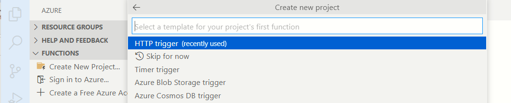

# Developing and deploying a Python Azure Function - Step by step
---

# Why did I write this?
I wanted to come to terms with developing and deploying a Python Azure Function. I have been working with C# Azure Functions for a quite a while now. Python development is different from C#. The first big difference is the absence of the mighty Visual Studio .NET. This forces us to rely on a myriad of tools. Python has its nuances. In this article, I have documented the steps I took to build and deploy a simple "Hello world" Python Azure Function. In the accompanying code, I have demonstrated a simple REST end point (also known as  Http trigger). 

---

# What was my business scenario?
I am working with a team of quantitative analysts who were looking for ways to migrate their free standing python web scraper scripts from on premise servers to Azure. These are scripts which run periodically,every few hours and scrape financial information from web sites. This information is dumped out into CSV files. I considered the following options and chose Azure Functions to start with.
1. Continous Azure Web job
1. Docker
1. Http trigger in an Azure function (orchestrated by a Azure Data Factory pipeline)

---

# Python Azure Functions - What is the big picture?


You will need the following tools. All of which are freely downloadable from Microsoft
- Visual Studio Code
- Azure Functions Core Tools
- Visual Studio Code Extensions for Azure Functions
- PowerShell Core
- Visual Studio Code Extensions for PowerShell
- Azure CLI
- Azure PowerShell modules (Az.Accounts,Az.Functions)

---
# Understanding Azure Function Core Tools

This is a free command line application made available by Microsoft. Azure Functions Core Tools lets you develop and test your functions on your local computer from the command prompt or terminal. Your local functions can connect to live Azure services, and you can debug your functions on your local computer using the full Functions runtime. You can even deploy a function app to your Azure subscription.

Example: To debug a function app locally, we would run the following command:

```bash
func host start
```
---
# What should be the overall folder structure?

As per [guidance from Microsoft](https://docs.microsoft.com/en-us/azure/azure-functions/functions-reference-python?tabs=asgi%2Cazurecli-linux%2Capplication-level#folder-structure),

```
 <project_root>/
 | - .venv/
 | - .vscode/
 | - my_first_function/
 | | - __init__.py
 | | - function.json
 | | - example.py
 | - my_second_function/
 | | - __init__.py
 | | - function.json
 | - shared_code/
 | | - __init__.py
 | | - my_first_helper_function.py
 | | - my_second_helper_function.py
 | - tests/
 | | - test_my_second_function.py
 | - .funcignore
 | - host.json
 | - local.settings.json
 | - requirements.txt
 | - Dockerfile
```

---

# What is the significance of the various files in the folder structure?


- Every function end point has it's own folder (http, message trigger, cosmos trigger, etc)
- The function runs under a Python virtual environment (venv)
- Azure Functions Core tools (func.exe) is what you would use for local debugging (launced from the root of the source directory)

---

# Step 0 - Determine which Python runtime to support 

Before we begin development of a Python Azure Function, we should be aware that we are limited by the Python engine(s) that Azure has to offer! You should run the following command to find all the versions of Python that are currently supported:

```dos
az webapp list-runtimes 
```
**Example**: Python versions 3.7, 3.8 and 3.9 are supported as April 2022

This is one of the main factors which is likely to influence your go-no go decision for Azure Functions. If your needs are custom, then there is Docker to fall back on.

---

# Step 1 - Using Visual Studio Code to create the skeletal structure

- Ensure you have the **[Azure Functions Core Tools](https://docs.microsoft.com/en-us/azure/azure-functions/functions-run-local)** tool installed
- Ensure you have the **Azure Functions Extensions** for Visual Studio Code installed
- Click on the **New Project** icon and respond to the questions from the wizard

#### First step - Create the project


### Final step - Create a skeletal trigger function


After completing the above steps you should end up with a folder structure similar to the one descibed in earlier sections

---
# Step 2 - Using Visual Studio Code to add a Http function end point
---

#### 1.Launch the new end point Wizard


#### 2.Select the type of the trigger
We are using **HttpTrigger** for this exercise


#### 3.Select the security model for this end point


---

# Step 3 - Debugging the Python function using Azure Function Core Tools
 - Place your break point in the  **main** function of **__init__.py**
 - Press **F5** to launch the debugger
 - Visual Studio Code will setup a local web server and attach the debugger (Azure Functions )
 - You should be able to hit the server using your browser or POSTMAN


**Caveat about debugging** - It is not enough to have the Azure Functions Tool. VS Code must have the right supporting files which help in launching the func.exe process and also attaching to it. I believe this happens through the combination of the files *tasks.json* and *launch.json* under the *.vscode* folder. 

---

# Step 4- Using PowerShell and Azure to CLI to deploy the Python function to an Azure functionapp

I have used **Azure PowerShell** and **Azure CLI** to script the deployment of the Azure Function. Having a single script  serves me two purposes:
#### Deploy from local workstation
I can develop and debug the script from the comfort of my workstation. I can use an IDE like VS Code with Powershell extensions to debug the script. I get rapid feedback.

#### Ability to re-use the script for a CI/CD solution
The same script can then be used via an automated deployment mechanism like Azure Devops or Octopus

#### Where is the deployment script?
```
[root]
    |
    |--infrastructure
    |    |
    |    |
    |    |--deploy.ps1
    |    |
    |    |
    |
    |
```

#### What happens inside deploy.ps1


#### How to run deploy.ps1
- Launch a session of PowerShell Core
- Navigate to the **infrastructure** folder
- **Attention** - Before running any Azure Cmdlet or CLI command, ensure you have set the context correctly (Refer appendix)
- Run **.\deploy.ps1**


#### Here is Azure doing a PIP install on the server!!


#### What if I want a higher performing App Plan on production environment?
The most likely scenario is as follows:
- A consumption function app plan on DEV
- A premium function app plan on UAT and PROD

How would you code **deploy.ps1** to handle such a deployment?

The CI/CD system (Azure Devops or Octopus, etc.) should inject an environment variable (e.g. "environment" set to DEV or UAT or PROD)  which will be picked up by the deployment script.

```powershell
$deploymentenv=$env:environment
$sku="B1"
if (($deploymentenv -eq "PROD") || ($deploymentenv -eq "UAT"))
{
    $sku="EP1"
}
az functionapp plan create --name $FunctionAppPlan --location $Location --resource-group $ResourceGroup  --sku $sku --min-instances 2  --is-linux $true | Out-Null

```

Refer this [MS documentation](https://docs.microsoft.com/en-us/azure/azure-functions/functions-premium-plan?tabs=portal) for information about function app plans.

---
# Step 5 - Ensuring that Unit tests are discovered by VS Code

#### How to configure VS Code for python unit tests?

Ensure that the **.vscode\settings.json** has the following elements. This will enable **Pytest**.
```json

{
    "python.testing.pytestArgs": [
        "tests"
    ],
    "python.testing.unittestEnabled": false,
    "python.testing.pytestEnabled": true
}
```
#### Where should we place the unit tests?
In the accompanying code, I  have created a skeletal unit test under the '**tests**' folder.


#### What does a basic Python unit test look like?
The Python file **test_Math.py** has the following class:

```python
import unittest
from shared_code import Math


class MathTests(unittest.TestCase):
    """Tests for MathTests."""
    def test_add_method(self):
        m=Math()
        result=m.add(100.1,0.2)
        self.assertEqual(100.3, result, 'The Add method should sump up')
        pass

```

#### Challenges faced
I faced the problem of VS Code not discovering the unit tests. This was primarily because VS Code was unable to resolve the references to the **Math** module


#### How did I solve the issue of test discovery?
For "**VS Code**" test discovery to work, I did the following:
- Launch a CMD
- Set the environment variable "**PYTHONPATH**" to a path that points to the top level folder containing the source code. The folder 'shared_code' is a subfolder under here `set PYTHONPATH=C:\work\python-azure-func-101\src`
- Launch **VS Code** from this CMD console


Is there a better solution to fix the test discovery? I would like to hear from you. I would rather rely on relative folders instead of having to set PYTHONPATH externally.

# What just happened?

#### View of assets in the Resource Group


#### View of the App settings of the function app

 

#### Invoking the Azure Function end point 


---

# How does Azure handle Python dependencies?

to be done. Talk about the deployment that happens online

# Where can I find the source code?

The code accompanying this article including the deployment script can be found in [this Github repo](https://github.com/sdg002/sdg002.github.io/tree/master/python-azure-func-101).

# References to docs on Microsoft

- [Quickstart: Create a Python function in Azure from the command line](https://docs.microsoft.com/en-us/azure/azure-functions/create-first-function-cli-python?tabs=azure-cli%2Cbash%2Cbrowser)
- [Quickstart: Create a function in Azure with Python using Visual Studio Code](https://docs.microsoft.com/en-us/azure/azure-functions/create-first-function-vs-code-python)
- [Configure a Linux Python app for Azure App Service](https://docs.microsoft.com/en-us/azure/app-service/configure-language-python)
- [Azure Functions Python developer guide](https://docs.microsoft.com/en-us/azure/azure-functions/functions-reference-python)
- [Develop Azure Functions by using VS Code](https://docs.microsoft.com/en-us/azure/azure-functions/functions-develop-vs-code?tabs=python)
- [How does VS Code launch tasks during debugging or for any custom purpose?](https://stackoverflow.com/questions/41483477/what-is-the-difference-between-launch-json-and-task-json-in-visual-studio-code)
- [Zip push deployment for Azure Functions](https://docs.microsoft.com/en-us/azure/azure-functions/deployment-zip-push#cli)
---

# Appendix 1

#### How to install PowerShell modules?
I prefer using the *CurrentUser* scope. Does not require admin privileges.

```PowerShell
Install-Module -Scope CurrentUser -Name Az.Accounts
```

#### Setting the Azure Context correctly (add to Appendix)
Before you run the publish command, the Azure subscription must have been set correctly. This is neccessary for Azure Function Core tool to detect the function app.  Run the following commands to ensure you are console is pointing to the right subscription. 

```
az account show
```

```powershell
Get-AzContext
Set-AzContext -Subscription "<name of your subscription>>"
$ctx=Get-AzContext
az account set --subscription $ctx.Subscription.Id

```


#### How to set Configuration parameters on Azure?
Example snippet below:
```powershell
    $settings=@{"name1"="value1"; "name2"="blah2"; "name3"="blah3"}
    Update-AzFunctionAppSetting -ResourceGroupName  $ResourceGroup -Name $FunctionApp -AppSetting $settings
```
Refer [documentation](https://docs.microsoft.com/en-us/azure/azure-functions/functions-how-to-use-azure-function-app-settings?tabs=azure-powershell#settings) from Microsoft

#### Is the Azure Function described in this article deployed anywhere?

- https://pythonfunc001.azurewebsites.net/api/HttpTrigger1?name=john
- https://pythonfunc001.azurewebsites.net/api/Add?num1=100&num2=300.55


#### How to find the supported Python versions on Azure?
Why is this important? Your local development environment is restricted by the runtimes supported on Azure.
```powershell
az webapp list-runtimes 
```
Sample output as of April 2022:
```json
{
  "linux": [
    "DOTNETCORE:6.0",    
    "DOTNETCORE:5.0",    
    "DOTNETCORE:3.1",    
    "NODE:16-lts",       
    "NODE:14-lts",       
    "NODE:12-lts",       
    "PYTHON:3.9",        
    "PYTHON:3.8",        
    "PYTHON:3.7",        
    "PHP:8.0",
    "PHP:7.4",
    "RUBY:2.7",
    "RUBY:2.7.3",        
    "JAVA:11-java11",    
    "JAVA:8-jre8",       
    "JBOSSEAP:7-java11", 
    "JBOSSEAP:7-java8",  
    "TOMCAT:10.0-java11",
    "TOMCAT:10.0-jre8",  
    "TOMCAT:9.0-java11", 
    "TOMCAT:9.0-jre8",   
    "TOMCAT:8.5-java11",
    "TOMCAT:8.5-jre8"
  ],
  "windows": [
    "dotnet:6",
    "dotnet:5",
    "DOTNETCORE:3.1",
    "ASPNET:V4.8",
    "ASPNET:V3.5",
    "NODE:16LTS",
    "NODE:14LTS",
    "NODE:12LTS",
    "PHP:7.4",
    "java:1.8:Java SE:8",
    "java:11:Java SE:11",
    "java:1.8:TOMCAT:10.0",
    "java:11:TOMCAT:10.0",
    "java:1.8:TOMCAT:9.0",
    "java:11:TOMCAT:9.0",
    "java:1.8:TOMCAT:8.5",
    "java:11:TOMCAT:8.5"
  ]
}
```
#### How to specify the Python version of the Azure function app?
The commandline option `functions-version` of `az functionapp create` specifies the Python engine version
```powershell
az functionapp create --name $FunctionApp --resource-group $ResourceGroup --plan $FunctionAppPlan --storage-account $FunctionStorageAccount --runtime python --runtime-version 3.8 --functions-version 3 --disable-app-insights
```


-----

# Appendix 2 - How to deploy the Azure Function?
#### How is Python different from .NET or NodeJS?
In case of Python, there is no build command (unlike C# or NodeJS). Therefore you will need to publish the raw contents. But,we must remember that the project directory has lots of files which are not to be deployed. E.g. the `.venv` directory.

#### How to use the publish command of Azure Functions Core Tools
You will need to use the Azure Function Core tool as follows:

```
func azure functionapp publish [name of the function app]
```
The function app should have been created prior to the above step using methods like `az functionapp plan create` and `az functionapp create`


#### Further reference on Azure Function Core tools
Follow [this link](https://docs.microsoft.com/en-us/azure/azure-functions/functions-core-tools-reference?tabs=v2#func-azure-functionapp-publish) for more details on how to use the **Func** tool

---


