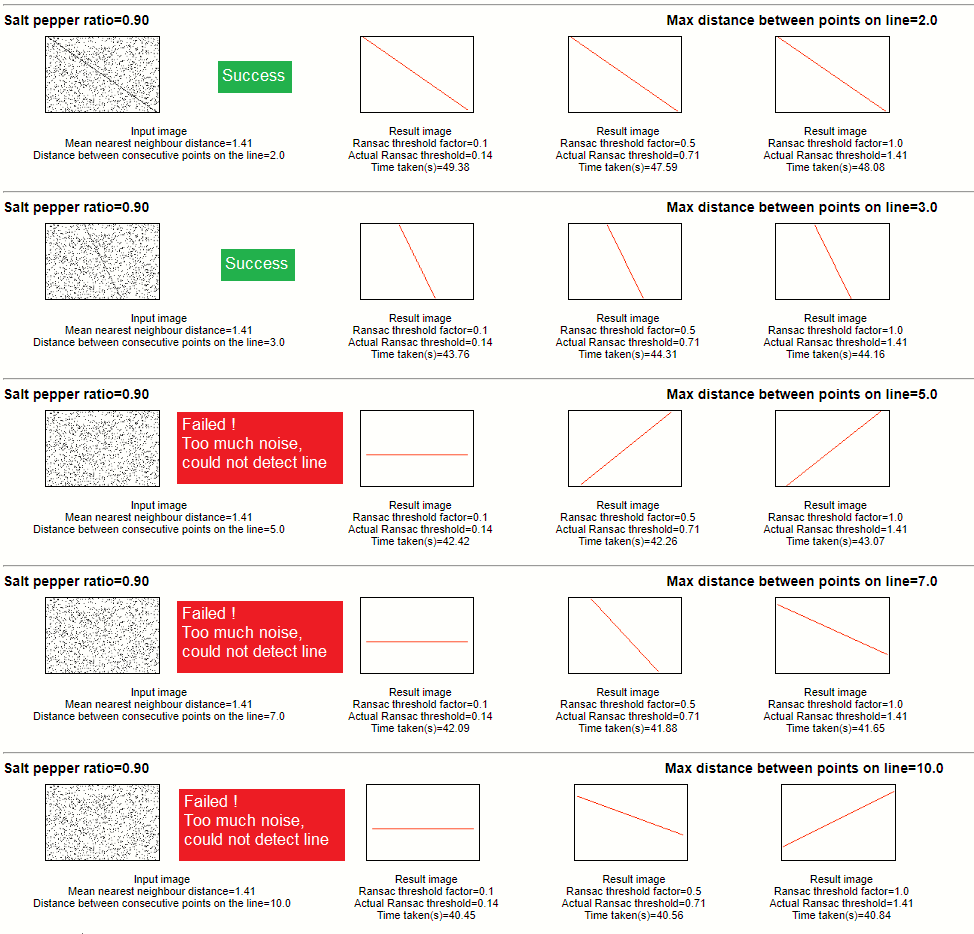
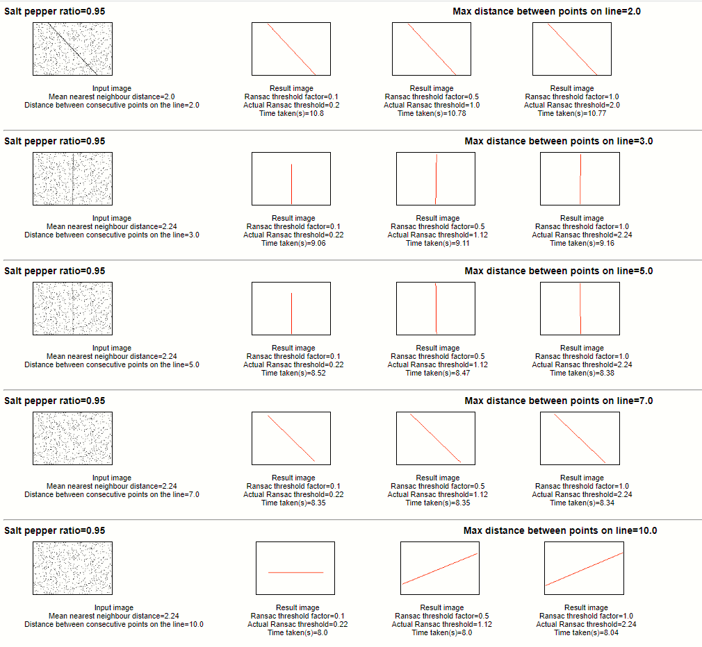
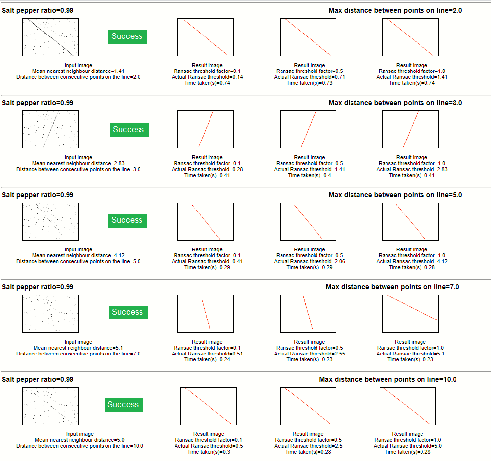

# Overview
This is the companion source code to my article on Medium titled [Nearest neighbour distance metric approach to determine the RANSAC threshold](https://medium.com/@saurabh.dasgupta1/nearest-neighbour-distance-metric-approach-to-determine-the-ransac-threshold-f0213562a196)  
In this article I have explored the possiblity of using the median Nearest Neighbour Distance as a means of arriving at the RANSAC threshold distance parameter. 

# What is the RANSAC threshold?
The tolerance Threshold is used by RANSAC in order to determine if a data sample agrees with a model or not. The RANSAC threshold defines the "band" in which points are considered to be inliers. Any point outside 
this band is considered to be an outlier and eliminated. 

# How to calculate the nearest neighbour distance?
I have used the Python class KDTree

# Outcome of RANSAC line determination on images with various salt-pepper densities

## Salt pepper ratio of 0.92

## Salt pepper ratio of 0.95

## Salt pepper ratio of 0.99

